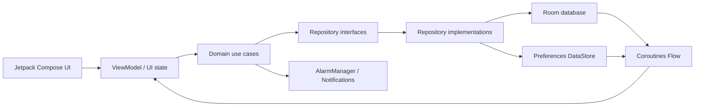

# HealthTracker

HealthTracker là ứng dụng Android theo dõi dinh dưỡng, vận động và tiến độ mục tiêu calorie. Ứng dụng hoạt động offline-first, không cần tài khoản, backend hay API key; dữ liệu sức khỏe được lưu cục bộ trên thiết bị.

## Tính năng

### Hồ sơ và mục tiêu sức khỏe

- Onboarding hai bước với họ tên, ngày sinh, giới tính, cân nặng, chiều cao, mức vận động và mục tiêu.
- Hỗ trợ ba mục tiêu: giảm cân, duy trì cân nặng và tăng cân.
- Ước tính BMR, TDEE và calorie mục tiêu ngay khi thiết lập hồ sơ.
- Chỉnh sửa hồ sơ và tự động tính lại BMI, BMR, TDEE, calorie mục tiêu.
- Phân loại BMI: thiếu cân, bình thường, thừa cân và béo phì.

### Dashboard

- Hiển thị calorie mục tiêu, đã nạp, còn lại và phần trăm tiến độ trong ngày.
- Hiển thị TDEE và calorie đốt từ hoạt động thể chất riêng biệt.
- Đánh giá trạng thái calorie theo đúng mục tiêu của người dùng: cần nạp thêm, đạt mục tiêu hoặc vượt ngưỡng.
- Tổng hợp các bữa ăn trong ngày và cung cấp thao tác nhanh để thêm món ăn hoặc vận động.
- Đề xuất điều chỉnh mức vận động và TDEE khi dữ liệu thực tế đủ tin cậy.

### Dinh dưỡng

- Danh mục thực phẩm mặc định có tên tiếng Việt và tiếng Anh.
- Tìm kiếm thực phẩm bằng tên đã chuẩn hóa và ưu tiên món yêu thích.
- Thêm món từ danh mục hoặc tạo món tùy chỉnh.
- Chọn khẩu phần theo gram và loại bữa: sáng, trưa, tối hoặc ăn nhẹ.
- Ghi bữa ăn cho hôm nay hoặc một ngày đã chọn.
- Lưu snapshot tên món và calorie trên 100 gram để lịch sử không bị thay đổi khi danh mục được cập nhật.
- Nhật ký theo ngày, tổng calorie, đánh giá mục tiêu và xóa món với bước xác nhận.

### Vận động

- Danh mục hoạt động mặc định kèm MET và biểu tượng.
- Đánh dấu hoạt động yêu thích để ưu tiên hiển thị.
- Chọn ngày, loại hoạt động và thời lượng tập.
- Tính calorie tiêu thụ từ MET, cân nặng tại thời điểm ghi và thời lượng.
- Lưu snapshot MET và cân nặng để số liệu lịch sử luôn nhất quán.
- Xem lịch sử theo ngày và xóa bản ghi với bước xác nhận.

### Thống kê

- Các khoảng thời gian: hôm nay, 7 ngày gần nhất, 30 ngày gần nhất và toàn bộ lịch sử.
- Tổng calorie, trung bình ngày và ngày có giá trị cao nhất cho lượng nạp và lượng đốt.
- Số ngày đạt mục tiêu, tỷ lệ đạt, chênh lệch so với mục tiêu, chuỗi đạt dài nhất, ngày đạt đầu tiên và gần nhất.
- Biểu đồ cột so sánh calorie nạp/đốt và biểu đồ đường thể hiện chênh lệch calorie mục tiêu.
- Biểu đồ được vẽ bằng Vico và đồng bộ với Material 3, dark mode cùng bảng màu semantic của ứng dụng.

### Nhắc nhở

- Nhắc bữa sáng, bữa trưa, bữa tối và vận động.
- Bật/tắt toàn bộ nhắc nhở và tùy chỉnh thời gian cho từng loại.
- Lịch mặc định: 09:00, 13:00, 19:00 và 21:00.
- Dùng exact alarm khi hệ thống cho phép, tự động hạ xuống inexact alarm khi không có quyền.
- Tự khôi phục lịch sau khi khởi động máy, đổi giờ, đổi múi giờ hoặc cập nhật ứng dụng.
- Mở đúng màn hình thêm bữa ăn hoặc vận động khi chạm thông báo.
- Có chế độ gửi thử nhắc bữa tối sau 30 giây.

### Widget và cá nhân hóa

- Widget Glance hiển thị calorie còn lại hoặc lượng đã vượt.
- Thêm nhanh bữa ăn, thêm hoạt động hoặc mở dashboard từ màn hình chính.
- Giao diện sáng, tối, hồng hoặc theo hệ thống.
- Ba cỡ chữ: nhỏ, vừa và lớn.
- Hỗ trợ tiếng Việt, tiếng Anh và bố cục RTL.
- Tạo bộ dữ liệu demo 60 ngày để kiểm tra dashboard và thống kê.
- Xóa toàn bộ hồ sơ, bữa ăn, lịch sử vận động và lịch nhắc để bắt đầu lại.

## Business logic

### BMI

```text
BMI = cân nặng (kg) / chiều cao² (m)
```

| Khoảng BMI | Phân loại |
|---|---|
| `< 18.5` | Thiếu cân |
| `18.5..<25` | Bình thường |
| `25..<30` | Thừa cân |
| `>= 30` | Béo phì |

Cân nặng và chiều cao phải nằm trong khoảng `1..300`. Ngày sinh phải hợp lệ và nhỏ hơn thời điểm hiện tại.

### BMR, TDEE và calorie mục tiêu

BMR dùng công thức Mifflin–St Jeor:

```text
BMR = 10 × cân nặng (kg) + 6.25 × chiều cao (cm) - 5 × tuổi + hệ số giới tính
```

- Nam: `+5`
- Nữ: `-161`

TDEE được tính từ `BMR × hệ số vận động`:

| Mức vận động | Hệ số |
|---|---:|
| Ít vận động | 1.2 |
| Nhẹ | 1.375 |
| Vừa | 1.55 |
| Rất năng động | 1.725 |
| Cường độ cao | 1.9 |

Điều chỉnh theo mục tiêu:

- Giảm cân: trừ `15% TDEE`, giới hạn trong `250..500 kcal`.
- Duy trì: không điều chỉnh.
- Tăng cân: cộng `10% TDEE`, giới hạn trong `200..350 kcal`.
- Calorie mục tiêu cuối cùng không thấp hơn `1.200 kcal/ngày`.

Mỗi khi lưu hồ sơ, BMR, TDEE và calorie mục tiêu được tính lại. Mốc bắt đầu theo dõi vận động cũ được giữ nguyên khi người dùng chỉnh sửa hồ sơ.

### Đánh giá calorie hằng ngày

Ứng dụng không dùng một ngưỡng chung cho mọi mục tiêu:

| Mục tiêu | Khoảng được xem là đạt |
|---|---|
| Giảm cân | `95%..100%` calorie mục tiêu |
| Duy trì | `95%..105%` calorie mục tiêu |
| Tăng cân | `100%..105%` calorie mục tiêu |

Nếu lượng nạp thấp hơn cận dưới, trạng thái là `NEEDS_MORE`; cao hơn cận trên là `EXCEEDED`; nằm trong khoảng là `GOOD`.

```text
calorie còn lại = calorie mục tiêu - calorie đã nạp
```

Calorie vận động được hiển thị riêng và không cộng trực tiếp vào hạn mức calorie còn lại.

### Calorie món ăn

```text
calorie món = calorie trên 100 g × khối lượng đã ăn / 100
```

- Giá trị phải hữu hạn và lớn hơn `0`.
- Kết quả được làm tròn về số nguyên, tối thiểu `1 kcal`.
- Một bữa ăn không được vượt quá `10.000 kcal`.
- Tên món không được để trống.

Khi hiển thị lịch sử, ứng dụng ưu tiên tên bản dịch theo ngôn ngữ hiện tại; nếu không có, tên snapshot lúc ghi món được sử dụng.

### Calorie vận động

```text
calorie đốt = MET × cân nặng (kg) × thời lượng (phút) / 60
```

- Hoạt động và MET phải hợp lệ.
- Thời lượng hợp lệ: `1..600 phút`.
- Cân nặng hợp lệ: `1..300 kg`.
- Thời điểm thực hiện dùng ngày người dùng chọn và giờ hiện tại.

### Đề xuất mức vận động

Ứng dụng phân tích tối đa 28 ngày gần nhất. Ngày không có bản ghi vận động được xem là ngày có `0 kcal` vận động.

```text
trung bình vận động = tổng calorie vận động / số ngày theo dõi
hệ số ước tính = clamp(1.2 + trung bình vận động / BMR, 1.2, 1.9)
TDEE ước tính = BMR × hệ số ước tính
```

Đề xuất chỉ xuất hiện khi:

- Có ít nhất 14 ngày theo dõi.
- Mức vận động ước tính khác mức đang lưu.
- TDEE ước tính chênh ít nhất `150 kcal` so với TDEE hiện tại.

### Tổng hợp thống kê

- `TODAY`: từ đầu ngày hiện tại.
- `LAST_7_DAYS`: hôm nay và 6 ngày trước.
- `LAST_30_DAYS`: hôm nay và 29 ngày trước.
- `ALL`: từ ngày đầu tiên có bữa ăn hoặc vận động.
- Khoảng truy vấn dùng `[đầu ngày bắt đầu, đầu ngày sau hôm nay)` theo múi giờ thiết bị.
- Calorie nạp theo ngày là tổng calorie của các bữa ăn.
- Calorie đốt theo ngày là `BMR hằng ngày + calorie vận động`.
- Trung bình ngày chia trên toàn bộ số ngày trong khoảng, kể cả ngày không có dữ liệu.
- Một ngày chỉ được tính đạt khi có calorie nạp, mục tiêu hợp lệ và trạng thái calorie là `GOOD`.
- Chuỗi đạt dài nhất được tính từ các ngày đạt liên tiếp.
- Chênh lệch mục tiêu bằng `tổng calorie nạp - mục tiêu ngày × số ngày`.

### Demo data, reset và tính toàn vẹn dữ liệu

- Demo data tạo 60 ngày bữa ăn và vận động dựa trên hồ sơ hiện tại.
- Việc thay dữ liệu demo chạy trong một Room transaction: xóa lịch sử bữa ăn/vận động cũ rồi chèn bộ dữ liệu mới.
- Reset dữ liệu tắt và hủy lịch nhắc trước, sau đó xóa lịch sử vận động, bữa ăn và hồ sơ.
- Khóa ngoại bảo vệ quan hệ giữa món ăn, bản dịch, bữa ăn, loại hoạt động và bản ghi vận động.

## Kiến trúc

Ứng dụng là một Android app module, tổ chức theo kiến trúc phân lớp kết hợp MVVM và unidirectional data flow.



- `presentation`: Compose screen, UI state, action/event và ViewModel theo từng tính năng.
- `domain`: model, repository contract, công thức và use case độc lập với UI.
- `data`: Room, DataStore, seed data, mapper và repository implementation.
- `di`: Hilt modules cung cấp database, repository, clock, DataStore và notification.
- `navigation`: type-safe route bằng Kotlin Serialization và Navigation Compose.
- `platform`: alarm, notification, receiver và xử lý khôi phục lịch nhắc.
- `widget`: Glance App Widget và entry point truy cập dependency từ Hilt.

```text
app/src/main/java/com/quyetbkhoa/healthtracker/
├── data/
│   ├── datastore/
│   ├── local/
│   │   ├── activity/
│   │   ├── food/
│   │   └── meal/
│   ├── repository/
│   └── seed/
├── di/
├── domain/
│   ├── model/
│   ├── repository/
│   ├── statistics/
│   └── usecase/
├── navigation/
├── platform/notification/
├── presentation/
│   ├── activity/
│   ├── activityhistory/
│   ├── dashboard/
│   ├── designsystem/
│   ├── meal/
│   ├── mealjournal/
│   ├── onboarding/
│   ├── profile/
│   ├── settings/
│   └── statistics/
└── widget/
```

## Lưu trữ dữ liệu

Room database hiện ở schema version 4:

| Bảng | Nội dung |
|---|---|
| `foods` | Dinh dưỡng, khẩu phần mặc định, yêu thích và thứ tự hiển thị |
| `food_translations` | Tên thực phẩm đã chuẩn hóa theo `vi`/`en` |
| `meals` | Snapshot món ăn, khẩu phần, calorie, loại bữa và thời điểm |
| `activity_types` | Danh mục vận động, MET, biểu tượng và yêu thích |
| `activity_records` | Snapshot MET, cân nặng, thời lượng, calorie và thời điểm |

Preferences DataStore lưu hồ sơ người dùng, theme, cỡ chữ, cấu hình lịch nhắc và trạng thái yêu cầu exact alarm. Ngôn ngữ ứng dụng được quản lý bằng per-app locale của AppCompat.

## Tech stack

| Nhóm | Công nghệ |
|---|---|
| Ngôn ngữ | Kotlin 2.2.10 |
| Build | Gradle 9.3.1, Android Gradle Plugin 9.1.1, KSP |
| UI | Jetpack Compose, Compose BOM 2026.02.01, Material 3 |
| State | ViewModel, Lifecycle, Kotlin Coroutines 1.10.2, StateFlow/Flow |
| Navigation | Navigation Compose 2.9.8, Kotlin Serialization |
| Dependency injection | Hilt |
| Database | Room 2.8.3, exported schema và migration |
| Preferences | Preferences DataStore 1.2.1 |
| Charts | Vico 3.2.1 Compose + Material 3 |
| Widget | Jetpack Glance App Widget 1.1.1 |
| Notifications | AlarmManager, NotificationCompat, BroadcastReceiver |
| Testing | JUnit 4, kotlinx-coroutines-test, Room Testing, AndroidX Test, Espresso, Compose UI Test |

## Yêu cầu môi trường

- Android Studio hỗ trợ Android Gradle Plugin 9.1.1.
- JDK 17 trở lên để chạy Gradle/AGP.
- Android SDK API 37.
- Thiết bị hoặc emulator Android 7.0, API 24 trở lên.

Project biên dịch source/target compatibility Java 11 và bật core library desugaring cho API Java hiện đại trên Android cũ.

## Cài đặt và chạy

```bash
git clone https://github.com/quyetbkhoa/HealthTracker.git
cd HealthTracker
```

Mở project bằng Android Studio, chờ Gradle Sync hoàn tất, chọn thiết bị và chạy cấu hình `app`.

Build APK debug:

```powershell
.\gradlew.bat assembleDebug
```

APK được tạo tại:

```text
app/build/outputs/apk/debug/app-debug.apk
```

## Kiểm thử

Chạy unit test:

```powershell
.\gradlew.bat testDebugUnitTest
```

Chạy Android instrumentation test trên thiết bị/emulator:

```powershell
.\gradlew.bat connectedDebugAndroidTest
```

Chạy lint:

```powershell
.\gradlew.bat lintDebug
```

Test hiện bao phủ các công thức BMI/TDEE/calorie, đánh giá mục tiêu, ước tính mức vận động, lưu hồ sơ, thêm món, tính thống kê, demo data, ViewModel thêm hoạt động và Room DAO.

## Quyền ứng dụng

| Quyền | Mục đích |
|---|---|
| `POST_NOTIFICATIONS` | Hiển thị nhắc bữa ăn và vận động trên Android 13 trở lên |
| `SCHEDULE_EXACT_ALARM` | Lên lịch đúng thời điểm khi hệ thống cho phép |
| `RECEIVE_BOOT_COMPLETED` | Khôi phục lịch nhắc sau khi khởi động thiết bị |

Nếu exact alarm chưa được cấp, ứng dụng vẫn lên lịch bằng alarm không chính xác tuyệt đối. Người dùng có thể bật/tắt nhắc nhở và thay đổi từng mốc thời gian trong Settings.

## Phạm vi dữ liệu

- Không yêu cầu đăng nhập.
- Không kết nối backend hoặc dịch vụ cloud.
- Không yêu cầu API key.
- Dữ liệu nghiệp vụ được xử lý và lưu trên thiết bị.
